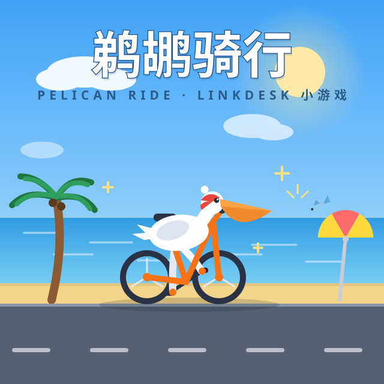

# Geme Tihu Bicycle

> One line: what this plugin does. (Keep it at the very top — this file is what the marketplace shows on the **Details** tab.)

<!-- When you have cover art, put the image at resources/cover.svg and uncomment the line below:
 -->

## How to use

How to open it in LinkDesk, where to click, what you should see. Spell out the path a first-time user walks.

## Directory layout — where things go

You do not need to pre-create empty folders (git does not track them). **Create them when you need them; the table below says where.**

| Path | What goes here | When it exists |
|:--|:--|:--|
| `plugin.json` | The plugin manifest | **Always** |
| `README.md` | Description — the data source for the marketplace **Details** tab | Strongly recommended |
| `CHANGELOG.md` | Release notes — the data source for the marketplace **Changelog** tab | Strongly recommended |
| `resources/` | Assets: `icon.svg` / `cover.svg` / images referenced from the README | Once you have images |
| `i18n/` | `en.json` (key = the source string; **do not create `zh.json`**) | Once you have UI text |
| `themes/` · `languages/` · `snippets/` | Payloads for data-only plugins | Data-only plugins |
| `src/index.tsx` | Entry (the `entry` in `plugin.json`) | Always for view plugins |
| `src/views/` | Sidebar / panel view components (the files `contributes.views` points at) | Once you have views |
| `src/components/` | Components reused inside this plugin | When needed |
| `src/services/` | Domain logic / IPC wrappers / data layer | When needed |
| `src/styles/` | **Multiple** CSS files — keep them together here (a single file next to the entry is fine too) | When needed |
| `src/__tests__/` | Unit tests (run `npm i -D vitest` yourself if you want them — the scaffold does not preinstall test tooling) | When needed |

> 🔴 **Shared things do not belong here** — components/hooks reused across plugins come from `@linkdesk/ui` (the public package the shell provides; it is already declared in `package.json` as `"latest"`, which resolves to the shell's current version line when you install — pin it to a specific shell version if you need a floor). The shell supplies that one instance at runtime, so **do not import its css** and **do not write a second copy inside your plugin**. Only logic that belongs to this plugin stays local.
> 🔴 **Assets always live in `resources/` — no loose images in the plugin root.** What gets into the install package is what is **referenced by the README** or **declared by `icon` / `marketIcon`**; the directory name itself has no magic.

## Three rules for this plugin

1. **Colors come from theme variables** — always `var(--xxx)` in CSS, **never a hard-coded hex**. Reason: LinkDesk supports full theme replacement, so a fixed color means your plugin does not follow the theme.
2. **UI text goes through `t()`** — `t("source string")`, with English in `i18n/en.json` and **no `zh.json`** (the source string is the key and is its own fallback). **Only add keys you actually read with `t()`** — an unread key is a dead key. Code identifiers (`src/index.tsx` and friends) are not copy — do not wrap them in `t()`.
3. **Plugin identity comes only from declared fields in `plugin.json`** — declare whatever capability you need (`contributes` / `tabBehavior` / `icon` …). **Never make other people guess what your plugin is from a directory name or file location.**

## Publishing

```bash
npm run publish     # create the GitHub Release + upload the .linkdesk-plugin + update the catalog
```

The first publish needs a GitHub token (the command walks you through it once and stores it locally). To see what it would do without doing it: `npm run publish -- --dry-run`.

Publishing also requires this project to be **pushed to GitHub** (`publish` uses your project's `origin` to create the Release):

```bash
git remote add origin git@github.com:<you>/<repo>.git
git push -u origin main
```

> The scaffold already created this repository for you (`main` branch + one initial commit), so this step is only about wiring the remote.
> If you generated with `--no-git`, run `git init -b main` and commit first.
